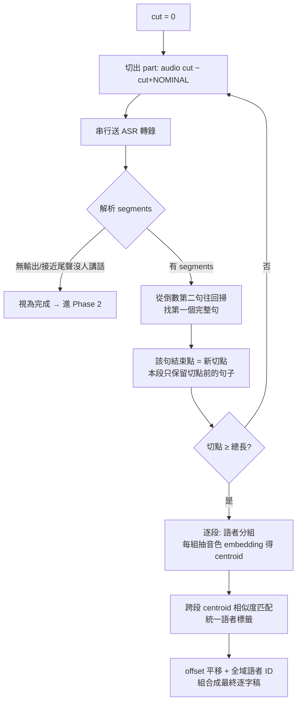

# 超長音訊管線設計 — 討論全記錄（2026-09-16）

## 背景閱讀（討論前現況盤點）

- 日誌回顧：2026-07-22 SAM-Audio 微服務化（`modules/sam_audio.py` → `serve/sam-audio/`）；
  2026-08-26 N9boWvU-KkA 切 4 段轉錄（963 segments）＋轉繁體＋肯定詞盤點；
  2026-08-27 過濾對齊＋影片剪輯；2026-09-01 片尾逐句切片。
- `modules/` 現況：`vad.py`、`asr.py` 仍是 TODO 骨架（`AsrConfig` 預設 Breeze-ASR-26、
  `VadConfig.chunk_seconds=300`）；實際可運作管線在 `exp/N9boWvU-KkA/scripts/`。
- 舊實驗已知缺陷（`transcript_combined.json` note 欄自述）：
  - 音訊**等分 4 段盲切**（各 1416.753922s），不避句界 → 句子可能腰斬、段頭句子失去左側語境
  - 「speaker 編號為各 part 獨立 diarization，跨 part 不具同一性」
- 舊片實際只有 2 位語者，且編號恰好沒跨段錯亂 → 後經 human 判定測試資料太簡單。

## v0：agent 初始提案（大半被取代）

- 切切斷點：靜音吸附（名義切點 ±45s 內找 ≥0.6s 靜音、切中點）＋ 相鄰段 5–10s 重疊 ＋
  重疊區去重（保留離自己邊界較遠的內部版本）
- 語者：全域 embedding 重分群 vs 跨段鏈式匹配兩案並陳
- 後續價值：帶出「語者統一不該依賴逐段傳遞」的討論方向

## v1：human 提案（逐字稿驅動迭代切分）

human 原始想法整理：

1. 第一段轉錄後，從**倒數第二句**開始從尾往回掃，找第一個「非 OVERLAP」句
   （未被邊界截斷的完整句），以**該句結束點**作為切點
2. 第二段直接從該切點往後繼續偵測，循環往復迭代直到所有音訊轉錄完成
3. 各大段內：相同語者**獨立說話**的片段找出來，提取音色 embedding（段內一群一群）
4. 群間找最相似 → 統一語者標籤
5. 最終依 offset 和語者標籤，組合成成品逐字稿

agent 分析補充：

- 核心洞察：切點由上一段的逐字稿自己回答，不需 VAD 調參；句界是語義單位（比靜音可靠）；
  天然串行（符合 vLLM 不可併發限制）；中斷續跑機制沿用
- 無句子腰斬 → 文字重疊去重需求消失；被跳過的尾端殘句由下一段完整重轉，自動被取代
- 風險與防護：
  - 「倒數第二句」一般化為 **margin 規則**：候選句須 `end ≤ part時長 − margin`
    （最後一句未必是被截斷者；尾端可能碎多句或有幻聽段）
  - ASR 時間戳有誤差 → 下一段提早 **guard（~0.3s）** 開始；多含的上一句尾音成碎段，
    以文字 fuzzy 對上段保留尾句後丟棄
  - 回掃找不到候選（尾端長獨白無句界）→ fallback 用 NOMINAL 盲切 + warning
  - **模型無輸出（接近尾聲沒人講話）→ 視為完成**（human 指定補入流程圖）

### 流程圖（定稿版，含無輸出分支）



註記（未定案）：若「無輸出」發生在離片尾還遠的中段（長音樂/靜音橋段）會提前收工，
是否加「無輸出且切點離片尾遠 → 前進 NOMINAL 繼續」分支，human 尚未裁決。

## v2：human 定案（相似度矩陣取代鏈式匹配）

- human 前提判斷：**段內 diarization 可信**——「同段內被 diarization 拆成兩個標籤的同一人
  從選用的模型架構上幾乎不會發生」
- 做法：每段每語者一個 centroid（段內 ≥1s 段的 embedding 平均）→ 所有段的 centroid
  兩兩算 cosine（M×M「自相似矩陣」，M = Σ 各段語者數，本片約 8–16 個 centroid）→
  過門檻者合併 → 頒布全域唯一標籤（依首次出場排序 G01、G02…）
- agent 確認的優點：
  - **不依賴時間相鄰**：某人只在段 0 與段 3 說話也能直接配（鏈式會斷鏈）
  - **無誤差累積**：一次全域計算，非沿段傳遞
  - 段內標籤可信 → 該組所有 segment（含短段）直接繼承全域 ID，不需逐 segment 指派

## v3：human 指出陷阱 + agent 約束強化（最終版）

- human 陷阱提示：「某一段的一個人配到另一段裡的兩個人，計算邏輯要小心」
- 修正：**constrained union-find**。形式化約束 =「每個全域叢集內，同一大段的標籤
  最多出現一次」（chunk → global 為單射）。同時擋兩個方向的錯誤：
  - A 段一人吸走 B 段兩人 → 叢集內 B 段出現兩次 → 拒絕
  - 兩人經第三方段多跳串連被合併 → 同樣被擋
- 演算法：

```text
候選 pair 按相似度由高到低排序
for (c1, c2) in candidates:
    if 相似度 <= τ: break
    if c1、c2 所屬叢集共享任一個大段:   # 段內唯一性檢查
        拒絕 → 記入 flag 清單（待人工裁決）
    else:
        合併兩叢集
```

- 模糊案例第二道防線：某 centroid 的前兩高相似對象都過 τ 且差距 < δ（0.05）→
  不自動配，flag 待人工；裁決時可用 per-segment embedding 的離散度輔助
- 診斷三件套：完整相似度矩陣（目檢校 τ）、合併決策日誌、拒絕＋flag 清單
  → 全自動範圍有保證：矩陣乾淨零人工、有歧義明確列出等人

## 測試資料決策（human 裁決）

- agent 先稱「Phase 2–4 不用重跑 ASR（用舊 transcript 驗證）」→ **被 human 糾正**：
  管線每一處都換掉了，相當於整條 pipeline 重寫，另開實驗資料夾全部重跑較穩妥
- 舊片太簡單：只有 2 位語者、編號恰好沒亂，無法驗證語者統一
- 新測試片：`https://www.youtube.com/watch?v=Ek7qDwwXZ6A`（直播存檔，更長更難）

## 探測結果（2026-09-16，yt-dlp `-J`）

- title：【喝酒對決】第二彈但出了點意外，跟原班人馬+1繼續喝酒！｜煌Kirali Ft. 麗玲、998汪汪、有理、阿毛、老妹喔耶
- duration：7824s（≈ 2h10m24s）
- is_live：False（存檔）
- video formats：248、399、616；audio formats：251-drc、140、251
- 估算：7824s ÷ NOMINAL(1440s) ≈ **6 段**
- 片名可見出場者：煌Kirali、麗玲、998汪汪、有理、阿毛、老妹喔耶 → 語者數可能 ≥5

## 已完成的環境準備

- `exp/Ek7qDwwXZ6A/scripts/` 目錄建立
- `uv venv exp/Ek7qDwwXZ6A/.venv` ＋ `uv pip install yt-dlp httpx`（yt-dlp==2026.8.19，與舊實驗同版）
- `.gitignore` 補 `tmp/`、`output.mkv`、`output.webm`、`output.mp4`（見條目 00）

## 最終參數表（暫定，待實測調整）

| 參數 | 初值 | 說明 |
|---|---|---|
| NOMINAL | 24min | 單次 ASR 穩定上限（承舊實驗 ~24min/份） |
| margin | 2s | 候選句 end 距音訊尾的安全距離 |
| guard | 0.3s | 下一段音訊提早開始量 |
| 短段門檻 | 1s | 進 centroid 的最短段長 |
| τ | 0.75 | 相似度合併門檻 |
| δ | 0.05 | 模糊案例偵測 gap |
| embedding | resemblyzer | 先 CPU 輕量方案；不足再 ECAPA-TDNN |

## 未確認清單（執行時驗證）

1. τ／δ／margin／guard 實際值——跑出矩陣分佈後調
2. 直播檔特性：BGM、掌聲、長沉默對 diarization／embedding 的干擾
3. 實際語者人數（片名 ≥5 人，可能有進出）
4. 「無輸出=結束」在長直播中段的誤判風險（分支未定案）
5. resemblyzer（torch CPU 版）安裝大小與耗時
6. ASR 伺服器 `10.46.219.5:8750` 執行當下可用性
7. format 399（AV1 1080p）對此直播存檔是否可用——下載時以「哪個成功用哪個」原則實測
